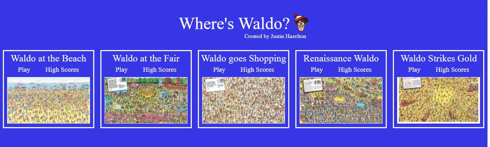
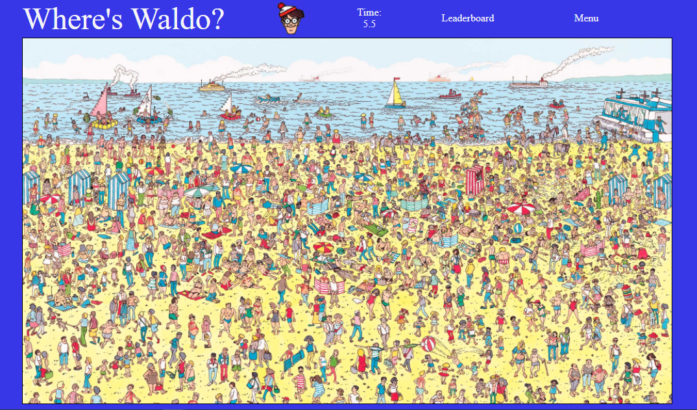
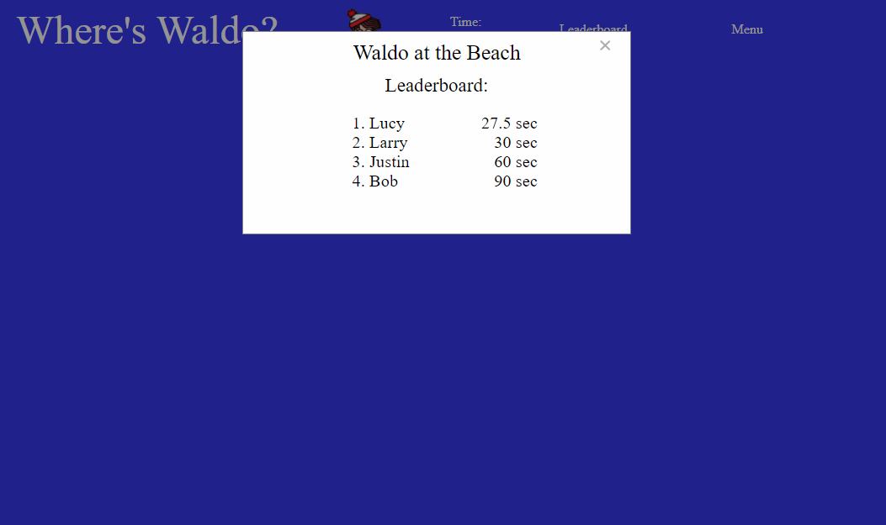

## To-Do List
App to play "Where's Waldo"

🔗 **Live preview** of the app is [here](https://j-haze.github.io/Wheres-Waldo/).

### Purpose: ###
Intergrate React front-end with Firebase back-end to create a full stack web application. The app lets you compete to find "Waldo" on various maps, and compare your time to others'.

### Features: ###

* Select between 5 different levels
* See how fast others found Waldo by checking the High Scores of each level
* Data stored within Firebase
* Backend Validation

### Built With: ###

* React 
* JavaScript
* Firebase
  * Storage
  * Hosting
  * Firestore
* HTML/CSS

### Picture: ###

Level Select:

Find Waldo at the Beach:

Leaderboard:

